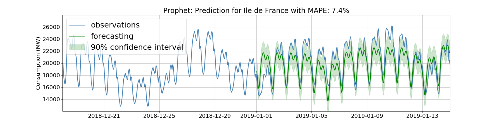
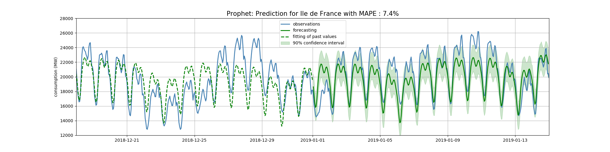
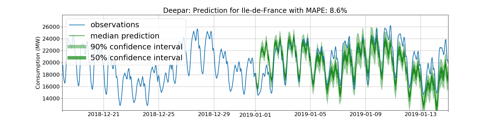
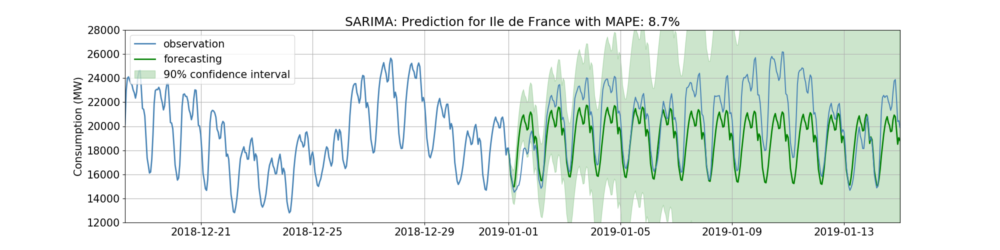
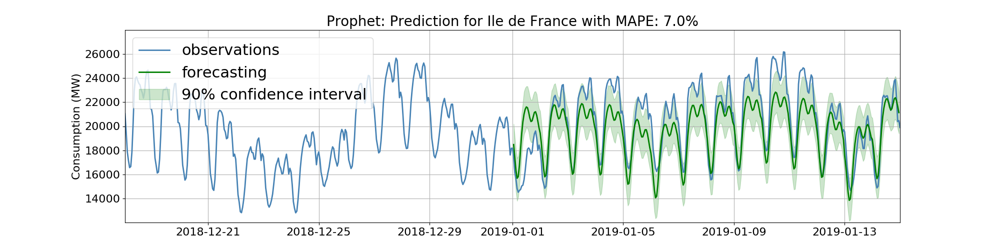

# Time Series made easy
Lors de la [Xebicon 2019](https://xebicon.fr/), Sameh Ben Fredj et moi-même avons présenté un [talk](https://www.youtube.com/watch?v=MkEIJC0QK3k&feature=youtu.be) autour des séries temporelles et des nouvelles méthodes permettant de faire de la prévision plus facilement. Cet article a pour but de résumer le contenu de ce talk et de présenter ses principales idées.

## Introduction aux séries temporelles 
Une série temporelle est de la donnée indexée dans le temps. Les séries temporelles sont désormais partout et les entreprises sont souvent amenées à en traiter. Par exemple, l’analyse de séries temporelles va être utile à l’entreprise pour faire de la prévision de chiffre d'affaire, des stocks de produits ou de production pour s'assurer qu'elle atteint ses objectifs.

Malgré ce besoin, les entreprises manquent souvent de ressources pour pouvoir traiter à l’échelle l’ensemble des données temporelles exploitables dont elles disposent. La situation est néanmoins en train de changer grâce à de nouveaux outils open source qui permettent d’obtenir de bons résultats sans devoir être un expert des concepts mathématiques sur lesquels reposent les algorithmes "classiques".

De part leur maturité et leurs retours d'utilisations, nous avons sélectionné deux outils principaux: [Prophet](https://facebook.github.io/prophet/) et [DeepAR](https://docs.aws.amazon.com/sagemaker/latest/dg/deepar.html) que nous détaillons par la suite.

## Présentation de Prophet
Prophet est un outil développé par Facebook dans le but de démocratiser les prévisions des séries temporelles et de les simplifier. Ce modèle convient particulièrement à des séries temporelles de type 'business' affectées par des événements ou des saisonnalités liées à l’activité humaine (exemple : fêtes de fin d'année, soldes, saisons, vacances, etc). Le modèle est implémenté dans un langage d'inférence statistique en C++ qui s'appelle Stan et est disponible en open source depuis 2017 en R et en Python.

Pour installer la version en python il suffit d’installer la dépendance [Pystan](https://pystan.readthedocs.io/en/latest/) qui est l'interface python pour Stan, puis le package Prophet en tant que tel:  
```bash
pip install pystan
pip install fbprophet
```
### Un petit aperçu du modèle sous-jacent
Le modèle de Facebook Prophet est un modèle additionnant 3 éléments: la tendance, la saisonnalité et l'effet des vacances / événements, plus du bruit:


La tendance est modélisée par défaut de façon linéaire continue par morceaux. Les points de changement de la tendance (`changepoints` dans l’API Prophet) sont automatiquement détectés mais peuvent aussi être spécifiés de façon explicite par l’analyste. Les changepoints sont représentés par les lignes pointillées verticales et la tendance est représentée par la ligne brisée rouge dans le graphique suivant issu de la [documentation officielle de Prophet](https://facebook.github.io/prophet/docs/trend_changepoints.html#automatic-changepoint-detection-in-prophet):


Prophet offre également la possibilité de modéliser des tendances de type croissance saturée, qui convient à des situations dans lesquelles il existe des limites haute et/ou basse à la grandeur que l’on cherche à prédire. Par exemple, le nombre d’utilisateurs de Facebook dans une ville va être contraint par le nombre d’habitants dans la ville. Les limites haute et basse peuvent évoluer dans le temps, et peuvent tout comme les changepoints mentionnés ci-dessus être soit calculées de façon automatique par le modèle, soit spécifiées par l’analyste comme dans ce cas issu de la [documentation](https://facebook.github.io/prophet/docs/saturating_forecasts.html#forecasting-growth):


La saisonnalité à l’échelle des jours, semaines, mois et années est gérée de façon automatique par le modèle. En cas de besoin spécifique, la modélisation de la saisonnalité [peut être paramétrée](https://facebook.github.io/prophet/docs/seasonality,_holiday_effects,_and_regressors.html#fourier-order-for-seasonalities) en ajustant sa sensibilité voire en programmant des saisonnalités conditionnelles (dans le cas où la saisonnalité à la semaine changerait en fonction de la période de l’année par exemple).

Enfin, les vacances et événements sont pris en compte via des tables renseignées par l’analyste. L’influence des vacances et événements sur les jours précédents et suivants peut être paramétrée via un paramètre de régularisation.

L’important à retenir est que l’API de Prophet permet à l’analyste d’avoir de bons résultats rapidement avec les valeurs par défaut, puis **d’enrichir le modèle de façon itérative avec de la connaissance métier**, via:

Le type de tendance (linéaire ou saturée), avec potentiellement une information explicite sur les changepoints ou les limites hautes et/ou basse de la quantité prédite;
L’ajout d’information sur la saisonnalité, par exemple la mise en place explicite d’une saisonnalité différente pendant une saison sportive;
La liste explicite des événements et/ou vacances pouvant impacter la valeur prédite;
La paramétrisation de la régularisation du modèle.
Cette vision est développée dans la section "Analyst-in-the-Loop Modeling" du papier "[Forecasting at scale](https://peerj.com/preprints/3190.pdf)" publié en 2018.

### Quelques mots sur l'API
L'api est semblable à celle de [scikit-learn](https://scikit-learn.org/stable/) avec l’utilisation d’une fonction `fit()` lors de l'entrainement du modèle et `predict()` pour prédire sur des données futures comme le montre l'exemple ci-dessous:
```python
from fbprophet import Prophet
 
m = Prophet()
m.fit(df_data)

# create future dates dataframe
future = m.make_future_dataframe(periods=365)
forecast = m.predict(future)
```
La paramétrisation des éléments décrits dans le paragraphe ci-dessus dépasse le cadre de cet article. Elle est très bien documentée dans la [documentation officielle](https://facebook.github.io/prophet/docs/quick_start.html#python-api).

## Présentation de DeepAR
L’algorithme DeepAR a quant à lui été développé par Amazon pour répondre à leur besoin de prédiction de vente de l’ensemble des produits en entraînant un unique modèle. En effet, les produits ont certes des dynamiques différentes mais l’expérience acquise par des produits avec un long historique peut bénéficier à la prédiction des ventes des produits plus récents. C’est cette particularité d’avoir la possibilité "clefs en main" d’entraîner un modèle unique sur un ensemble de séries temporelles pouvant apprendre les unes des autres qui est la grande spécificité de DeepAR, avec le fait que l’algorithme repose sur du deep learning. [Le papier de recherche de présentation de DeepAR](https://arxiv.org/abs/1704.04110) a été publié en avril 2017 par Amazon, puis l’algorithme a été mis en open source au sein du package [gluonTS](https://gluon-ts.mxnet.io/) en Juin 2019.

L’installation de DeepAR est très simple:
```bash
pip install gluonts
```
### Un petit aperçu du modèle sous-jacent
Le modèle de DeepAR repose sur un réseau de neurones récurrents (recurrent neural networks ou RNN) par dessus duquel est ajoutée une couche d’apprentissage d’une distribution de probabilité. Le modèle calcule en effet chaque prédiction en fonction des valeurs précédentes, qui peuvent elles-mêmes être des prédictions. Il apprend ainsi, au fur et à mesure, les meilleurs paramètres permettant de générer les paramètres de la distribution de probabilité à partir de l’output du RNN, noté h sur le graphique ci-dessous:


Les indices i correspondent à l’indice de la série temporelle concernée car le modèle peut s’entraîner sur un ensemble de séries temporelles

Au moment de la prédiction, l’utilisateur va demander au modèle de générer un certain nombre de simulations, typiquement une centaine. Il obtiendra alors comme sortie, pour chaque prédiction, la distribution de l’ensemble des valeurs prises par le modèle lors des différents essais. Cela permet d’estimer l’incertitude du modèle et de générer des marges de confiance. À noter qu’il est possible de choisir le type de distribution de probabilité (gaussienne par défaut) ainsi que la structure du RNN que le modèle va utiliser. On voit de plus que le modèle accepte des covariables en entrée, c’est-à-dire des données que l’on connaît déjà dans le futur au moment de faire nos prédictions, typiquement les dates de vacances ou d’événements.

Un autre apport important de DeepAR pour entraîner un unique modèle sur un ensemble de séries temporelles est une heuristique de gestion de l’échelle des données d’entrées. Dans le cas de la prédiction des ventes de produits, certains produits sont beaucoup plus populaires que d’autres, ce qui risque de pénaliser l’apprentissage du RNN. De plus, l’échantillonnage des données ne doit pas se faire de façon tout à fait aléatoire pour ne pas pénaliser les produits qui ont peu d’historique mais beaucoup de ventes. DeepAR gère automatiquement ces deux problématiques ([section 3.3 du papier de recherche](https://arxiv.org/abs/1704.04110)).

### Quelques mots sur l'API
L'API de DeepAR est légèrement plus complexe que celle de Prophet mais reste très facilement abordable. L'instanciation des données se fait avec l'objet `ListDataset` puis l'estimateur s'entraîne tout simplement avec la fonction `train`:
```python
from gluonts.model.deepar import DeepAREstimator
from gluonts.trainer import Trainer
from gluonts.dataset.common import ListDataset

estimator = DeepAREstimator(freq=data_freq,
                            prediction_length=7*24,
                            trainer=Trainer(epochs=30, learning_rate=0.0001))
 
training_data = ListDataset(
    [{"item_id":...,
      "start": ...,
      "target": ...}],
 freq = "H")
 
estimator.train(training_data)
```

À noter que le paramètre `trainer` de l'objet `DeepAREstimator` permet de configurer le RNN du modèle de façon très fine (cf [documentation](https://gluon-ts.mxnet.io/api/gluonts/gluonts.model.deepar.html)).

La prédiction se fait quant à elle via la fonction `make_evaluation_prediction` fournie par le package, et qui prend en argument `num_eval_samples` qui correspond au nombre de simulations que le modèle va calculer pour échantillonner les distributions de probabilité.

```python
from gluonts.evaluation.backtest import make_evaluation_predictions
 
test_data = ListDataset(
            [{"item_id": ...,
              "start": ...,
              "target": ...}],
              freq = "H")
 
forecast_it, ts_it = make_evaluation_predictions(test_data, predictor=predictor, num_eval_samples=100)
```
## Et si on appliquait sur un cas d'usage ?
### Présentation du cas et des données utilisées
Nous avons choisi pour illustrer la performance de Prophet et DeepAR un jeu de [données open source de consommation énergétique heure par heure des régions françaises](https://opendata.reseaux-energies.fr/explore/dataset/eco2mix-regional-cons-def/information/?disjunctive.libelle_region&disjunctive.nature). Ce jeu de données comporte des séries temporelles similaires pour les différentes régions, on pourra donc vérifier si le fait d’entraîner un modèle sur l’ensemble des régions plutôt que sur une seule permet d’améliorer la performance sur la région choisie.


Nous avons comparé 3 algorithmes différents: DeepAR, Prophet et [SARIMAX](https://www.statsmodels.org/dev/examples/notebooks/generated/statespace_sarimax_stata.html), un modèle statistique plus classique. Ces trois modèles ont été entraînés avec la consommation de la région Île-de-France sur 2 ans entre le 1er janvier 2017 et le 31 décembre 2018. Leur performance a été mesurée sur 2 semaines de prédiction au 1er janvier 2019 (soit 336 heures) par l’écart relatif moyen avec la réalité (mean absolute percentage error ou MAPE).

### Prédiction de la consommation d'énergie sur la région de l'Ile de France
#### Prophet


Les performances du modèle Prophet sont honorables étant donné l’extrême simplicité de l’implémentation du modèle. On remarque que le modèle n’a pas de contrainte de continuité avec les données réelles au début de la prédiction. Cela est dû au fait que Prophet fait un fit global de la courbe et c’est ce fit qui est continu:


#### DeepAR


Les résultats de DeepAR sont sensiblement meilleurs que ceux de Prophet sur cet exemple: l’écart relatif moyen est inférieur, les prévisions se font dans la continuité des dernières valeurs réelles, et l’intervalle de confiance est plus resserré. Le modèle a été ici entraîné uniquement sur les données de l'Île-de-France et les prédictions ont été faites en lançant 100 simulations (`num_eval_samples=100` dans la fonction `make_evaluation_predictions`). La valeur retenue pour calculer l’écart relatif moyen à la réalité est la médiane des distributions de valeurs pour chaque pas de temps.

Attention, point important à garder en tête: les résultats de DeepAR sont moins stables que les résultats de Prophet. Les performances peuvent varier d’un entraînement de modèle à l’autre même si les mêmes paramètres sont utilisés (écart relatif moyen pouvant typiquement varier du simple au double sur les 15 jours de prédiction au 1er janvier 2019). En revanche, les prédictions sont assez stables lorsqu’on les lance plusieurs fois avec le même modèle (écarts de l'ordre de 0,1% d'écart relatif moyen au maximum en faisant une dizaine de fois la prédiction avec `num_eval_samples=100`). L’étude de la stabilité de DeepAR fera l’objet d’un futur article, en attendant c’est un point à bien surveiller si l’on se pose la question de l’industrialisation du modèle.

Les résultats ci-dessus sont obtenus en entraînant le modèle uniquement sur les données de l’Île-de-France. Voici les résultats obtenus pour l’Île-de-France avec un modèle entraîné sur toutes les régions:


Techniquement, la seule différence est dans la construction du `ListDataset` d’entraînement, qui contient uniquement la série temporelle d’Île-de-France dans un cas et celles de toutes les régions dans l’autre. Dans ce cas précis l’utilisation des données de l’ensemble des régions n’a pas l’air d’améliorer les performances.

#### SARIMAX


La performance du modèle SARIMAX est moins bonne que celles des modèles Prophet et DeepAR dans cet exemple, sur trois aspects importants:

- L’intervalle de confiance à 90% explose très rapidement et perd son sens.
- L’écart relatif moyen est plus élevé.
- Le modèle a beaucoup de mal à capter la saisonnalité à l’échelle de la semaine, que Prophet et surtout DeepAR captent très bien.

De plus, et c’est un facteur très important à prend en compte, **le développement du modèle SARIMAX nécessite beaucoup plus d’expertise et de temps que celui des modèles Prophet et DeepAR**. On a vu à quel point les API de Prophet et DeepAR étaient simples. L'utilisation du modèle SARIMAX nécessite non seulement de faire des tests statistiques car le modèle ne fonctionne que sous certaines hypothèses ([stationnarité du processus sous-jacent à la série temporelle](https://fr.wikipedia.org/wiki/Stationnarit%C3%A9_d%27une_s%C3%A9rie_temporelle) notamment), mais aussi de paramétrer des arguments qui ont un sens mathématique complexe comme l’ordre de la partie autorégressive du modèle.

Il ne s’agit pas ici pour nous de conclure que ce genre de modèle mathématique "expert" n’a aucune valeur. Il est tout à fait possible que ce soit la meilleure solution dans certains cas d’usage. Notre conclusion est néanmoins qu’une personne qui souhaiterait monter en compétence sur l’analyse de séries temporelles arrivera à de bons résultats bien plus rapidement avec Prophet et DeepAR qu’avec cette classe de modèles plus complexes à prendre en main.

## Ajout de covariables
Pour rappel, une covariable correspond à une donnée dont on dispose dans le futur au moment de faire la prédiction, et qui peut informer cette dernière. Dans notre cas il semble logique que la météo puisse faire office de covariable car une partie de la consommation d’énergie est due au chauffage. On fait l’hypothèse de prévisions météo parfaites et on utilise la température maximale journalière à Paris issue comme covariable (sources: open data [Agri4Cast](https://agri4cast.jrc.ec.europa.eu/dataportal/) et [historique-meteo.net](https://www.historique-meteo.net/france/ile-de-france/paris/2019/) pour les données les plus récentes).

L’ajout de covariable se fait très facilement pour Prophet comme pour DeepAR, avec la fonction `add_regressor` pour l’un et l’argument `use_feat_dynamic_real` pour l’autre:
```python
from fbprophet import Prophet
m = Prophet()
m.add_regressor(‘temp’)
m.fit(df_data)
estimator = DeepAREstimator(freq=data_freq,
                            prediction_length=7*24,
                            trainer=Trainer(epochs=30, learning_rate = 0.0001),
                            use_feat_dynamic_real=True)
 
training_data = ListDataset(
    [{"item_id": ...,
      "start": ...,
      "target": ...,
      "feat_dynamic_real": ...}],
      freq = "H")
 
estimator.train(training_data)
```
L’utilisation de cette covariable permet d’améliorer la performance de prédiction, que ce soit pour Prophet:


... ou pour DeepAR:


Attention ! Les covariables ne peuvent pas avoir de valeurs manquantes pour DeepAR. Si vous laissez des valeurs manquantes traîner dans vos covariables vous obtiendrez ce message d’erreur inapproprié de DeepAR:
```python
gluonts.core.exception.GluonTSDataError: Encountered invalid loss value! Try reducing the learning rate or try a different likelihood.
```
## Pour conclure, 
Il est clair que les efforts fournis par les géants du web pour démocratiser l’analyse de séries temporelles ont porté leurs fruits en permettant à des data scientists n’ayant pas forcément l’expertise mathématique nécessaire à l’utilisation de modèles comme SARIMAX d’arriver très rapidement à des résultats exploitables. Le tableau suivant résume les différences principales entre Prophet et Deepar:


Les deux modèles valent le coup d’y passer un peu de temps !.